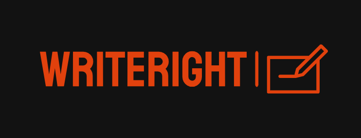
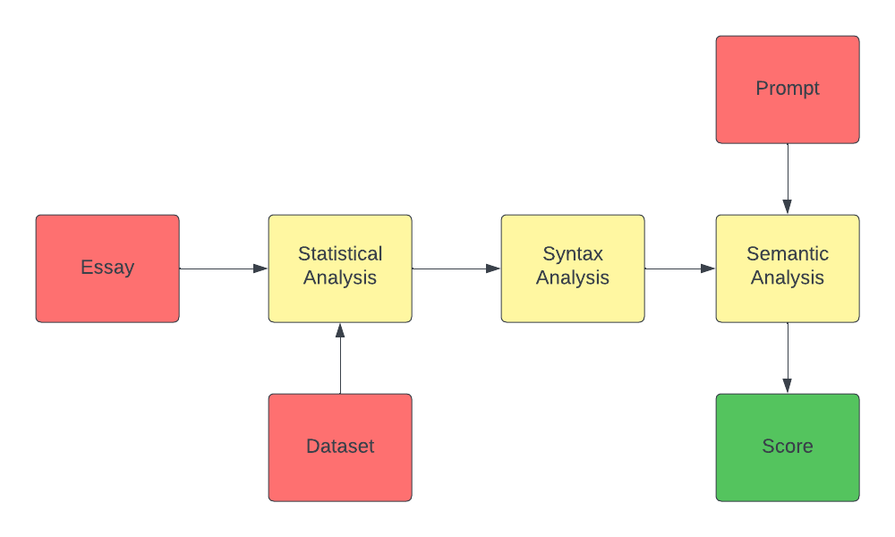

# WriteRight

<p align="center">
    
</p>

## Table of Contents

- [WriteRight](#WriteRight)
  - [Table of Contents](#table-of-contents)
  - [About The Project](#about)
  - [Demo](#demo)
  - [Flowchart](#flowchart)
  - [Documentation](#documentation)
  - [File Structure](#file-structure)
  - [Future Goals](#future-goals)
  - [References](#references)
  - [License](#license)
  

## About

The computerized grading of essays by machine learning and natural language processing is known as Automated Essay Scoring (AES). The project's primary goal is to rate an essay from 1 to 10 based on a variety of criteria. The algorithm considers three primary factors: the quality of word and phrase usage (Statistical), the correctness of the grammar (Syntax), and the essay's coherence and depth (Semantics). This makes essay evaluations more interpretable and accurate, while also saving time for educational institutions and tests like the GRE.

## Demo

## Flowchart

<p align="center">
    
</p>


## Documentation

Please refer ```/documentation``` or click <a href="https://github.com/PritK99/WriteRight/blob/main/documentation/README.md">here</a> for complete documentation of the project

## File Structure
```
👨‍💻WriteRight
 ┣ 📂assets                            // Contains all the reference gifs, images
 ┣ 📂data                              // Datasets for training and Testing
 ┃ ┣ 📄train.csv  
 ┣ 📂Documentation                     // Complete Documentation and Project Workflow
 ┃ ┣ 📄README.md
 ┣ 📂model                             // Standalone model         
 ┃ ┣ 📄main.py    
 ┃ ┣ 📄statistics.py
 ┃ ┣ 📄syntax.py                
 ┃ ┣ 📄semantics.py 
 ┣ 📄README.md
``` 

## References
* Unsupervised learning during the statistical phase was conducted using a dataset from Kaggle's Feedback Prize – English Language Learning competition. The dataset can be accessed <a href="https://www.kaggle.com/competitions/feedback-prize-english-language-learning/data?select=train.csv.">here</a>.
* Hewlett Foundation's <a href="https://www.kaggle.com/competitions/asap-aes/overview">Automated Essay Scoring Competition</a>, held in 2012.
<a href="The Hewlett Foundation: Automated Essay Scoring">Automated Essay Scoring</a> competion by Hewlett Foundation.
* Reference was made to the following <a href="https://github.com/ZhuoyueWang/AutomatedEssayScoring">GitHub repository</a> for Automated Essay Scoring.

## Future Goals

- [ ] Considering more features such as number of Short Words, number of Long Words, Sentence Formation, Capitalization etc.
- [ ] Improving the Web Application by adding better UI and Features.
- [ ] Using Deep Learning Techniques such as LSTMs and CNNs to improve the performance of the algorithm.

## License
[MIT License](https://opensource.org/licenses/MIT)