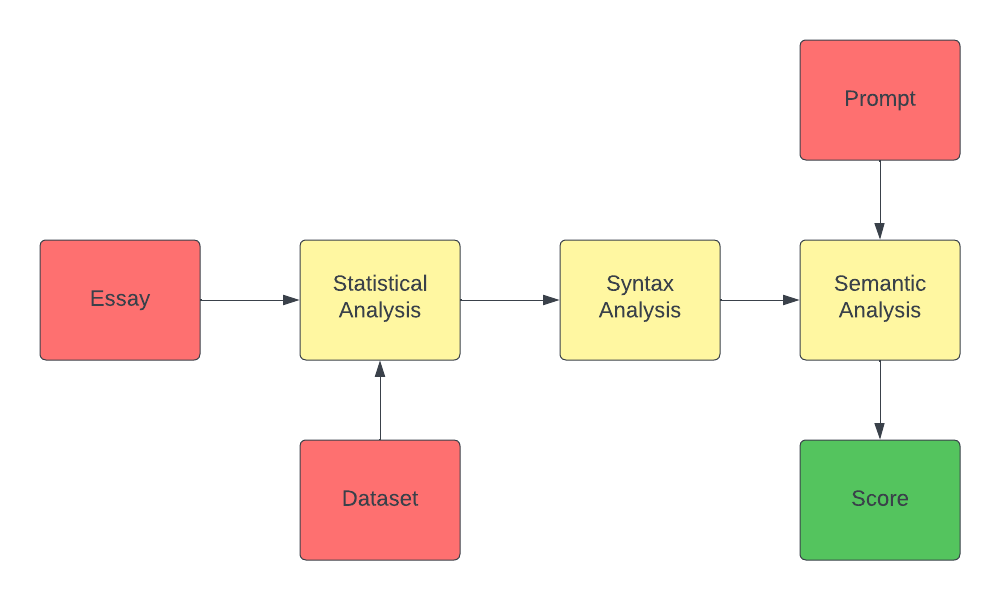

# WriteRight - Automated Essay Scoring System

<p align="center">
    
</p>

## Introduction & Motivation

The computerized grading of essays by machine learning and natural language processing is known as Automated Essay Scoring (AES). The project's primary goal is to rate an essay from 1 to 10 based on a variety of criteria. The algorithm considers three primary factors: the quality of word and phrase usage (Statistical), the correctness of the grammar (Syntax), and the essay's coherence and depth (Semantics). This makes essay evaluations more interpretable and accurate, while also saving time for educational institutions and tests like the GRE.

## Background & Motivation

Inspired by the need for quick and free essay evaluations during my GRE preparation, I decided to develop an AES system. Although not perfect, it's a useful introduction to Natural Language Processing and Machine Learning.

In opting for traditional Machine Learning Techniques with handcrafted features, our goal was to enhance the interpretability of the AES system. Rather than employing more complex neural network architectures like LSTMs or CNNs, which might act as opaque models or black boxes, we deliberately chose model to be transparent. The objective is to empower users by providing a clear understanding of the scoring process, enabling them to identify specific areas for improvement.

## Overview & Project Workflow

Taking inspiration from the work, as outlined in the <a href="https://github.com/ZhuoyueWang/AutomatedEssayScoring">GitHub repository</a>, we propose implementing a similar system. Our Automated Essay Scoring (AES) system operates on a modular architecture, strategically divided into three distinct modules. Each module is designed to capture specific elements and features of the essay, contributing to a comprehensive and nuanced evaluation. The scoring process is orchestrated by assigning weights to the scores obtained from each module, culminating in the final assessment. The three distinct modules are as follows:

* Statistical Analysis
* Syntax Analysis
* Semantics Analysis

<p align="center">
    
</p>

## Module I: Statistical Analysis

The Statistical Analysis stage employs Unsupervised Learning techniques, extracting essential statistical features related to words, sentences, and POS-Tags usage. The goal is to quantify language proficiency and evaluate vocabulary richness.

* Word and Sentence Metrics:
    * Word count, sentence count, and words per sentence are calculated for each essay.
    * Normalization is applied to these metrics by dividing them by the total number of essays.

* Parts of Speech (POS) Tags Frequency:
    * POS tags frequency is calculated for each essay using nltk's pos_tag function.
    * The frequency of each tag is normalized.

```
for essay in essays:
    sentences = sent_tokenize(essay)
    num_sentences += len(sentences)

    words = word_tokenize(essay)
    tags = nltk.pos_tag(words)

    num_words += len(words)

    for tag in tags:
        if tag[1] in norm_pos_freq:
            norm_pos_freq[tag[1]] += 1
        else:
            norm_pos_freq[tag[1]] = 1
```

All these features, once extracted, are normalized by dividing them with total number of essays.

```
norm_num_words = (int)(num_words / len(essays))
norm_num_sentences = (int)(num_sentences / len(essays))
norm_num_words_in_sentences = (int)(norm_num_words / norm_num_sentences)
```

* Penalty System:
    * Features extracted from the user's essay are compared to the normalized values.
    * A penalty system is implemented based on the variance from the average, with weights assigned to each feature. Essentially, we penalize the essay on the basis on how far it is from normailzed values.

```
penalty_ratio = (num_words_penalty + num_sentences_penalty + 2*num_words_in_sentences_penalty + pos_penalty)/5
penalty_score = (penalty_ratio*10.0)
```

In our penalty system, each feature is assigned a weight reflecting its importance. Notably, we double the penalty for deviations from the average number of words in a sentence, emphasizing the significance of maintaining consistency in sentence length. This approach aims to address the possibility that users might use fewer or more words in an essay, but they generally tend to use the same number of words in a sentence.Thus, we try to  penalize deviations per sentence more heavily than variations in the overall essay length.

Similarly, for POS-Tags, our system imposes higher penalties for deviations from the average frequency of major POS-Tags, prioritizing consistency in commonly used tags like 'NN' or 'VB' over rare ones such as 'PDT' or 'SYM.' This strategy aligns with the expectation that users are more likely to employ common POS-Tags in their essays.

## Module II: Syntax Analysis

The primary goal of Syntax Analysis is to penalize essays based on the total number of misspelled words with respect to the total number of words in the essay. This phase is crucial for improving grammatical accuracy and providing users with constructive feedback. The implementation relies on the enchant library and its SpellChecker module to identify and suggest corrections for spelling errors.

The penalty factor (alpha) allows for flexibility in adjusting the stringency of the evaluation. The final syntax score reflects the overall grammatical correctness of the essay, with higher scores indicating fewer spelling errors. The penalty system in Syntax Analysis operates on the premise that the more misspelled words present in an essay, the lower its grammatical accuracy. The penalty factor (alpha) provides a means to fine-tune the system's sensitivity to spelling errors. The resulting syntax penalty is subtracted from a maximum score of 10, yielding the final syntax score.


```
alpha = 1.15     # Penalty Factor
syntax_ratio = spelling_error(essay)
syntax_penalty = alpha*syntax_ratio*10
```

## Module III: Semantics Analysis

In the third phase of our Automated Essay Scoring (AES) system, we shift our focus to Semantics Analysis. This crucial phase assesses the overall coherence and relevance of the essay in comparison to a given prompt. The primary objective of Semantics Analysis is to provide a quantitative measure of how closely the content of the essay aligns with the provided prompt. The implementation utilizes the sentence_transformers library to calculate semantic similarity scores. The SentenceTransformer library is employed with the 'paraphrase-MiniLM-L6-v2' pre-trained model to encode both the prompt and the essay into embeddings. Cosine similarity is calculated between the embeddings of the prompt and essay using the pytorch_cos_sim function.

```
# Encode prompt and essay into embeddings
prompt_embedding = model.encode(prompt, convert_to_tensor=True)
essay_embedding = model.encode(essay, convert_to_tensor=True)

# Calculate cosine similarity
similarity_score = util.pytorch_cos_sim(prompt_embedding, essay_embedding).item()
```

We've incorporated adjustments to the scoring mechanism based on empirical observations during testing. This modification aims to ensure accurate grading by considering the observed similarity score distribution. One things we observed while testing was that even for very close essays, similarity score were around 7.5 - 8. Thus, to ensure proper grading, we consider all cosine similarity scores above and equal to 7.0 as perfect 10.0. For similarity scores between 0.0 and 7.0, a scaling factor is applied to project these scores onto a 10.0 scale. This adjustment ensures that scores are distributed more evenly across the available range. If the similarity score is below or equal to 0.0, the essay continues to receive a score of 0.0.

```
similarity_score = get_similarity(prompt, essay)
    
    if (similarity_score >= 0.7):
        return 10.0
    elif (similarity_score <= 0.0):
        return 0.0
    else:
        return (similarity_score*10.0)/0.7
```

## Scoring

In the final stage of our Automated Essay Scoring (AES) system, a holistic view of the essay is taken, and a comprehensive final score is computed. The scoring is based on the weighted sum of the three key phases: Statistical Analysis, Syntax Analysis, and Semantics Analysis.

```
statistic_score = statistics_check(essay)
syntax_score = syntax_check(essay)
semantic_score = semantic_check(prompt, essay)

total_score = (statistic_score + 2*syntax_score + 2*semantic_score)/5
```
The final scoring process acknowledges the importance of each phase while considering the nuanced contributions of statistical, syntactic, and semantic evaluations. The double weighting of syntax and semantics scores reflects their heightened significance in the overall assessment. The normalization step ensures a fair and consistent final score distribution.

## Conclusion

In summarizing the project, it becomes evident that essay grading is a nuanced process that considers various features, with the ones explored in this project representing fundamental aspects. However, it is crucial to acknowledge the inherent limitations, especially in the statistical module, which relies heavily on the characteristics of the dataset. The choice of a dataset with a prevalent trend in essay length introduces a dependency that might not universally hold. Despite the availability of modern deep learning methods that offer increased accuracy, the use of handcrafted features allows for a more interpretable assessment.